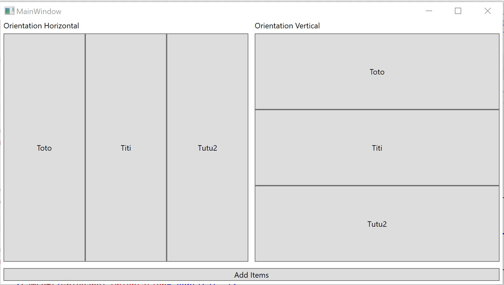

# GridPanel

A WPF Panel for ItemsControl that's works like a grid.

How to use it ?

First, add the namespace :

```
xmlns:samsoft="clr-namespace:SamSoft.Windows"
```

Then you can integrate it as ItemsPanelTemplate like this : 

```
<ItemsControl ItemsSource="{Binding Items}">
    <ItemsControl.ItemsPanel>
        <ItemsPanelTemplate>
            <samsoft:GridPanel Orientation="Vertical" />
        </ItemsPanelTemplate>
    </ItemsControl.ItemsPanel>
</ItemsControl>
```

It's possible to change the orientation of the GridPanel with values Vertical or Horizontal. 



[Download GridPanel now!](GridPanel/GridPanel/GridPanel.cs) 


